# Air-Quality-Analysis(空氣品質分析)[連結](http://210.60.51.33/)

  
  <h1 align="center">Air-conditioner</h1>
  
製作者:陳品誌

## 功能特點

- 監測空氣品質指標：該專案使用感測器來測量空氣品質指標，例如PM2.5、臭氧等。這些感測器可以連接到嵌入式系統或單獨的硬體裝置。
- 數據收集和儲存：專案會定期收集感測器數據，並將其儲存在資料庫中。這樣可以建立歷史數據庫，以便後續分析和可視化。
- 網頁展示：專案提供一個網頁界面，用於顯示空氣品質指標的數據和預測結果。該界面可以呈現圖表、圖形和其他可視化方式，以方便用戶理解和分析數據。

## 技術組件

這個專案包含以下技術組件：

- **感測器和數據收集**：使用各種感測器來監測空氣品質指標，例如空氣品質監測器、溫度和濕度感測器等。感測器數據通常通過嵌入式系統或單獨的硬體裝置進行收集。
- **資料庫**：使用一個資料庫系統（例如MySQL、PostgreSQL等）來儲存感測器數據和其他相關資訊。這樣可以方便地進行後續的數據管理和分析。
- **網頁展示**：使用網頁開發技術（如HTML、CSS、JavaScript等）來構建一個用於顯示空氣品質數據和預測結果的網頁界面。可以使用一些JavaScript圖表庫（如Chart.js、D3.js等）來實現數據的可視化。

## 材料(一台機器所需的設備)
- 開發版：ESP8266(Nodemcu V2)
- 臭氧感測器：MQ-131
- PM2.5感測器：PMS5003
- 溫溼度感測器：DHT11(也可使用DHT22，但程式碼上要改參數)
- 太陽能板(含12V輸出)
- 電量顯示器(可有可無)
- OLED顯示器:SSD1306
- 穩壓IC X2(盡量選功耗低的)

## 電路圖

## Arduino需要自行下載的函式庫
- MQUnifiedsensor.h
- DHT.h
- PMS.h
